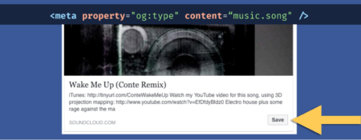
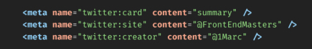
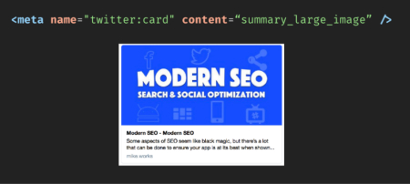
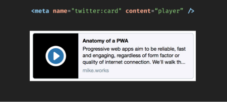
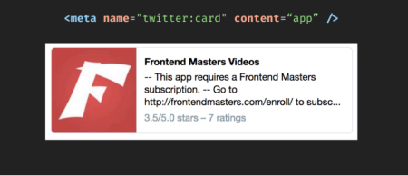
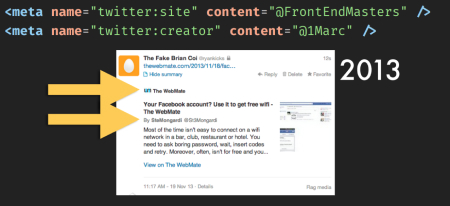
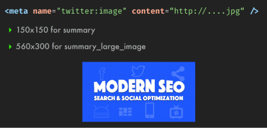

  <h1>Meta Data</h1>

   

  

## Basics Meta Tags

- **title** : 30/65 characters.
- **description** : 120/156 characters brief summary of what the page is about.
- **keywords** : don't matter anymore.

## OpenGraph Meta Tags

[*link source protocol*](https://opengraphprotocol.org/)

### Facebook OpenGraph

#### The Image OpenGraph (og:image)
 
 Its a great thing to have an image representing the visual of the brand, if not it could be better to not publish a bad visual for the brand

> notice: its a great thing to have an image well dimensioned

#### The Url OpenGraph (og:url)

 The canonical url, no matter from where its redirected , it will be this canonical url

- clear !== between the fetched **VS** canonical urls
- usually the desktop version
- no session variables, no pagination parameters or other counters

#### The Type OpenGraph (og:type)

Impact how your URLs get enriched in user's media feeds

> defaults to "website"

### Twitter Card

Lots of possibilities, but it need to be really consistent in our job. Video Cards will be checked to avoid abuses. The Twitter UI might change and with all of that possibilities, it open up an opportunity to adapt our strategy with those tools, components...

> **CARD VALIDATOR TOOL:**
 [Twitter Card Validator:](https://cards-dev.twitter.com/validator/)

#### The Card Types (twitter:card)

- **The Summary Card (summary)**

- **The Large Image Summary Card (summary_large_image)**

- **The Player Video Card (player)**

- **The App Card (app)**

> **NOTICE:**
>
>- Lots of possibilities to **customize** the published card-picture
>- Need a **permission** to being "whitelisted", to check the domain, avoiding abuses.
>- **Strategy to set up**, with some adapted purposes...

#### The Twitter Site & Twitter Creator (twitter:site twitter:creator)

#### The Twitter Image (twitter:image)

