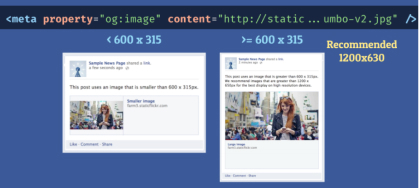

 

<h1>Search Engine Optimization Helper</h1>

 

General overview of search engine optimization made from fork repo and courses on that topic...

## Social media metatags templates

Social media metatags allows you to add social information to your website or contents.
When you are sharing a url to social networks, they will find the social information which you defined between head tags.
In order to easily handle this routine on every project, we gather all the right metatags on this repository.

### Social networks supported

- Facebook
- Twitter
- Pinterest
- Google +
- Google authorship

> API infos from:   > https://api.mike.works/api/v1/courses

### OpenGraph

#### Facebook og

. **og:image :** its a great thing to have an image representing the visual of the brand, if not it could be better to not publish a bad visual for the brand

> notice: its a great thing to have an image well dimensioned

. **og:url :** the canonical url, no matter from where its redirected , it will be this canonical url

> -> clear !== between the fetched and canonical urls
>   -> usually the desktop version
>   -> no session variables, no pagination parameters or other counters

. **og:type content="article" :** impact how your URLs get enriched in user's media feeds

> defaults to "website"

#### Twitter og

#### Pinterest og
