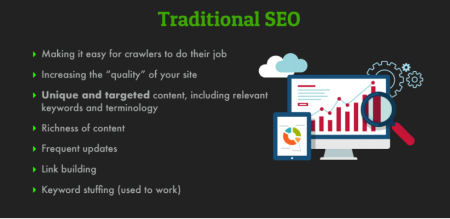
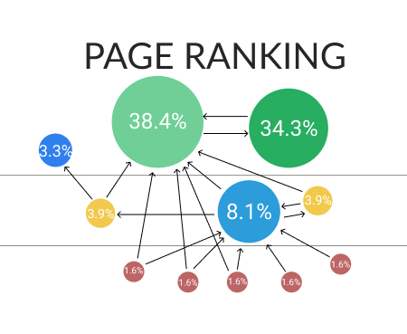
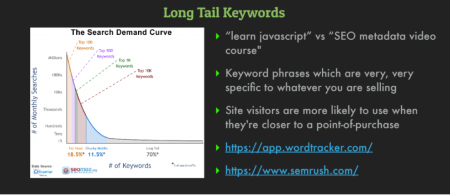
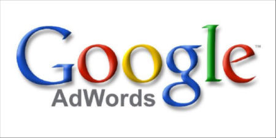

[API link](https://api.mike.works/api/v1/courses)

  <h1>Modern Search Engine Optimization (SEO)</h1>

   

  

  
Course on 
    <a href="https://frontendmasters.com" target="_blank">frontendmasters.com</a> 
  by Mike North working at LinkedIn, CEO of 
    <a href="https://mike.works/" target="_blank">Mike.works
    </a>
  

## Strategies

Traditional paths to SEO, building sites with unique and target content that's easy to spiders to index. Tips & Process for brick-and-mortar businesses.

### Physical Location

- create a complete Google [*My Business*](https://www.google.com/intl/fr_fr/business/) Page
- submit your business to local directories : [*moz.com/local*](https://moz.com/local)
- handle the errors / outdated infos in Local Citations.[*local-seo*](https://seo.co/local-seo/)
- set specific geographic-targeting in [*Google Search Console*](https://developers.google.com/search)
- ask for reviews for your business and display on your website
- acquire local back links - vendors, partners, local NGOs ...
  
### PageRank

The First algorithm used by Google for search results. PageRank works by **counting the number and quality of links to a page** to determine a rough estimate of **how importance of a site compared to other sites** of a similar nature or content.

### Long Tail Keywords

3 or 4 keywords phrases that are very specific to a site's content or business...

> **Key Words Tools:**
>- [App WordTracker](https://www.wordtracker.com/)
>- [Sem Rush](https://www.semrush.com/)

### Keywords Planner Tools

**Two main tools for finding potential keywords:** Google's Keyword Planner & Google Trends

> **Keywords Planner Tools:**
>- [Google Keyword Planner](https://ads.google.com/home/tools/keyword-pla)
>- [Google Trends](https://trends.google.com/trends/)

### Link Building Campaign

> How to build authority within an industry and research competitor's site to help with link building strategy.

- **Create Key Pages** for your popular product and services
- **Focus Inbound links to Key Pages** => higher ranking
- **'Link Velocity'** => how to rate, a content/pages earn links over time
- **Guest Post** on trustworthy industry / authority sites
- **Analyze competitors** link profile/id, link opportunity: [Spyfu](https://www.spyfu.com/)

### White Hat vs Black Hat

> Desire of organic, sustainable growth with SEO tactics **VS** trying to subvert search engine algorithms.

### Bad Links

1. Remove links reference from **spammy websites**
2. Review **Search Traffic & Links**
3. **Disavow Bad Links**
4. **Eliminate Links Exchange** with others websites
  => *add <rel="nofollow">*
5. **Remove dead links** to your site

> **Removing bad links tools & tips:**
>- [Google Search Console](https://search.google.com/search-console/)
>- [Google Disavow Tool](https://support.google.com/webmasters/answer/)

### Ad Campaigns

> Besides organic SEO strategy, here an intro of buying ads on search engines as a way to drive traffic.

1. Target the Right Audience
2. Cost Effective
3. Deploy Marketing Budget (if it matters)
4. Short Feedback Loop
5. Control Over Risk
  
**NOT A MAGIC PILL**

. CPM Cost Per 1000 impressions
. CPC Cost Per Click
. CPA Cost Per Action (conversions)
. CPI Cost Per Install
