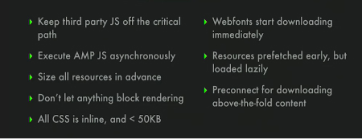
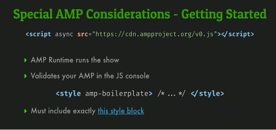
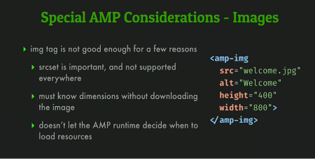
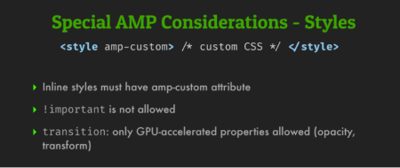

  <h1>Accelerated Mobile Pages (AMP) Project</h1>

   

  

[AMP boiler plate github](https://github.com/ampproject/amphtml/blob/master/spec/amp-boilerplate.md)

There are search results which attempt to present, particularly on mobile device, **a really fast loading into this links**.
The AM Project is **collective effort led by Google, Facebook and some other big company...**

We have to play by some strict rules...

## How It Works

We don't get put our own javascript on the critical path to rendering. **No component library**, to built our own AMP HTML. We can create iframe that have js inside of those but iframes are not on the critical path.
We do get to build some rich components which are centrally maintained in the AMP Project.
No React, No Angular, No Vue...

It's executed as **asynchronous javascript**.

Same as Facebook size images, we can pre-size our images to be sure of the rendering. So we have to **use the image AMP component** which it looks like an image tag. Size is monitoring, so we can lay everything out in advance and rely on the calculation.
No reflows **everything is already adapted of each viewport**.

Don't let anything block rendering, **No  extern CSS files**, everything is inline styles and the size for Stylesheets is < 50kb.

In the same idea, web fonts are loaded immediately because of the no block stylesheets, **everything is loaded immediately**. No reference to external stylesheets, no first loading & parsing step before loading the web fonts as example. Same idea to the async javascript.

**Resources pre-fetched early**, and **evaluated as late as possible**.

There is **a new standard trying to pre-connect for download in advance**.

## Get It Started

[AMP boiler plate github](https://github.com/ampproject/amphtml/blob/master/spec/amp-boilerplate.md)

- The script tag is **controlling the resource download and presentation pipeline**.
- The style boiler plate block it involves CSS animation that helps transitions

The amp-img tag is different and don't go fetching the image on the first place.
> On mobile, we want to get **a maximum of data, resources first, then download them** in an adapted way to.

To write custom CSS it needs to put the **"amp-custom"** attribute on your inline CSS styles.
> **No !important and only opacity and transform** be used on transitions property.