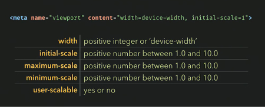
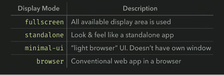

  <h1>Mobile Optimization</h1>

   

  

   

- [add-to-home-screen](https://github.com/cubiq/add-to-homescreen)

## Intro

Google **forks their search index**, their "master data" in 2 categories because of the mobile traffic explosion.
The relevant and importance in search results in various keywords.
Now they have search index for desktop and also for Mobile.

*Shopping, getting more infos, checking mails, adresses, businesses...*

Beyond everything, one thing which enters in consideration, is **the way the app/website is fit**, **the way he looks on mobile devices**. A sort of "fitness" of the app and how well it present itself...

## The Viewport 

 

> A bunch of key value-pair separated by comas

For the "Width" setting, you start out with the width of the viewport being the device width.
**Make sure the CSS is displaying for a 300px width** as it does to a large screen, that it really zoom out.

The initial-scale set to 1, control if it zoom out or in...The Maximum and Minimum to prevent and control a zoom IN or OUT. 

The user-scalable is an ON/OFF setting to being able to zoom or not on the device(default yes)

> If we want to turn the user experience **to a native app, its necessary to set to OFF**
> Maybe on certain area on the site but not on the navbar or another UI Component

## The Full-screen Mode

 

 A special case, needs to be turned it to "YES" and it will **be displayed like a mobile app** only if is launched from the home screen bookmark.

 > The Full-screen value by default is "NO"

 On that mode, there is also the possibility to put **the status bar black**.

 Then the **"Home Screen Title" button animation** (not max of 30 characters)

## The Manifest.json

> Supported by Android devices (until 2017 at least)
> calling "The Web App Manifest"

Create a json file, refer to it with a tag, and place some infos that will help to create a really nice experience on mobile devices.

The Name for the title, a **192px icon** for the actual android **home-screen button(hi-dpi resolution)**, and a **512px icons to a solid color background** to animate.
The theme color change the title bar color of the app.
The **background** will be also the screen color of the unpainted area when the app is loading.
The **display value "standalone"** is the equivalent of **full-screen** on Apple device.

> If a device does not support one of these, it will fall one down into the 
> list and try to support that

The Full-screen mode is more like a game UI instead of the "standalone" mode being more like an mobile app.

## Home Screen Icons

[Favicon set generator](https://realfavicongenerator.net/)

> It will need a tag for each device
> But there's some tools on the web to generate them

## Add To Home Screen Lib

[add-to-home-screen: the github repo...](https://github.com/cubiq/add-to-homescreen)

> NOTICE: that its a bad practice even it can be really great to captive the user adding your app to home
> It could be handled in terms of frequency, and set it on the script
