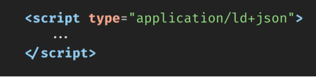
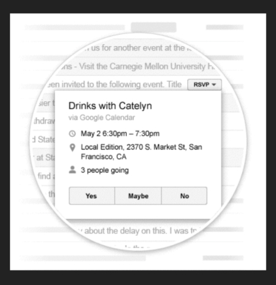
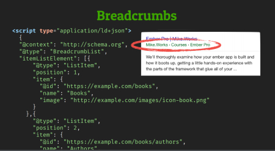
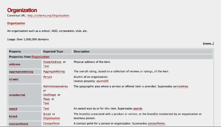

  <h1>Structured Data</h1> 

  

  

  

## What Is This ?

1 **Infos** that crawlers are looking for, and can easily read
2 **Consistent structure**
3 **Formatted on ld-json** in a special script tag

## What Does This Get Us ?

1 **Enhance features** in apps
2 **Indexers don't have to guess so mush** about connections between things
3 More controls over the **search results look**

## Breadcrumbs

  

[*Schema org website*](https://schema.org/)

